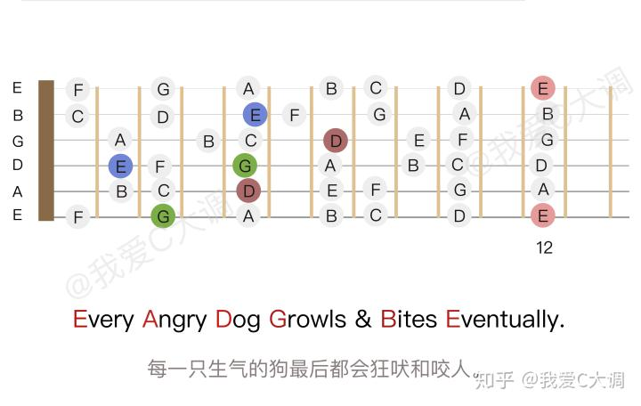

# 1.2 乐音体系在吉他上的应用

## 种类

## 原声吉他的构造

## 基本演奏方式

左手按住指板上的品格，右手弹拨相应的弦。

### 左手手型

- 用指尖按弦
- 用力按弦
- 各指关节要呈弯曲状
- 按弦时确保其他手指不会碰到其他弦
- 拇指应放在琴颈的背部
- 确保每一个弹出的音都清澈嘹亮

### 右手手型

各手指名：

- 大拇指 P
- 食指 i
- 中指 m
- 无名指 a
- 小指 ch

基本对应的弦：

- P - 6、5、4 弦
- i - 3 弦
- m - 2 弦
- a - 1 弦

## 音列排布

吉他的指板上，相邻两品音高相差半音，隔一品相差全音。

标准调弦下，每根弦的空弦音从 6 弦到 1 弦分别是 E A D G B E 。

- 6 弦（最粗的弦）空弦音：低音的 E
- 5 弦空弦音：低音的 A
- 4 弦空弦音：中音的 D
- 3 弦空弦音：中音的 G
- 2 弦空弦音：中音的 B
- 1 弦（最细的弦）空弦音：高音的 E

每次演奏前，都应该使用「调音器」进行调音。推荐使用手机上的调音器 app 。

在 6 弦上，空弦音为 E，再加上相邻两品音高相差半音的特点，可以推算出 6 弦上各品的音列。

其他各弦也是一样的推算方法，最后可以得出指板上所有品格的音列。

## 音域

吉他的音域是三个八度多一点，也就是大约 40 个半音。从 6 弦空弦到 1 弦空弦是两个八度，1 弦空弦到 1 弦十二品是一个八度，12 品往上一般还能弹几个音。
