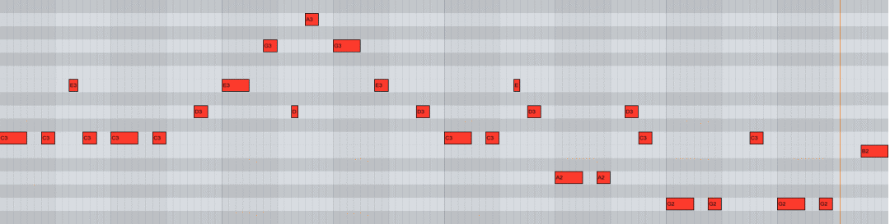

# 1.4 旋律

旋律（Melody），是由一系列不同音高（也可以是相同的）的音以特定的高低关系和节奏关系联系起来的序列，现代音乐三要素之一。旋律是音的序列在时间上横向的发展，主要内容有：

- 音符（note）：记录不同高度与长度的音的符号，由「音高」与「时值」构成。

- 音高（pitch）：音的频率的高低。

- 时值（note value）：音的相对持续时间长度。音符时值的全长单位叫做「全音符」，全音符的一半为「二分音符」，二分音符的一半为「四分音符」，以此类推还有「八分音符」、「十六分音符」、「三十二分音符」。

