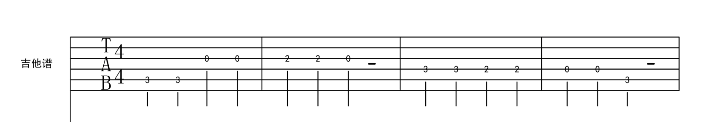

# 1.5 节奏与旋律在吉他谱上的应用

Tablature（六线谱 / TAB 谱）是一种演奏吉他的记谱方式。它记录了乐曲演奏时对应的琴弦与品格。

- 6 条横线代表吉他的 6 条琴弦，从上往下依次是 1 弦 ~ 6 弦。
- 数字代表应当按住的品格，数字所在的横线对应相应的琴弦，实际上就代表了音符与其音高。这样可以读作：1 弦 1 品、1 弦 3 品，3 弦 3 品等。
- 拍号代表了乐曲的节拍。例如  即代表「以四分音符为一拍，每小节有 4 拍」。
- 时值则以这种竖线标识来代表，各个时值如下（横线为增时线，每加一条表示加一倍原时值）：

人声演唱方面，节奏与旋律在简谱上的应用也是同理，略过。
