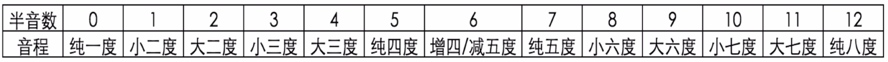
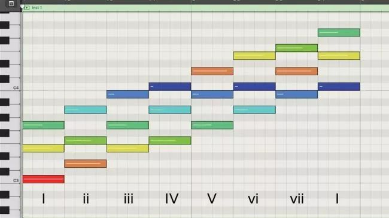
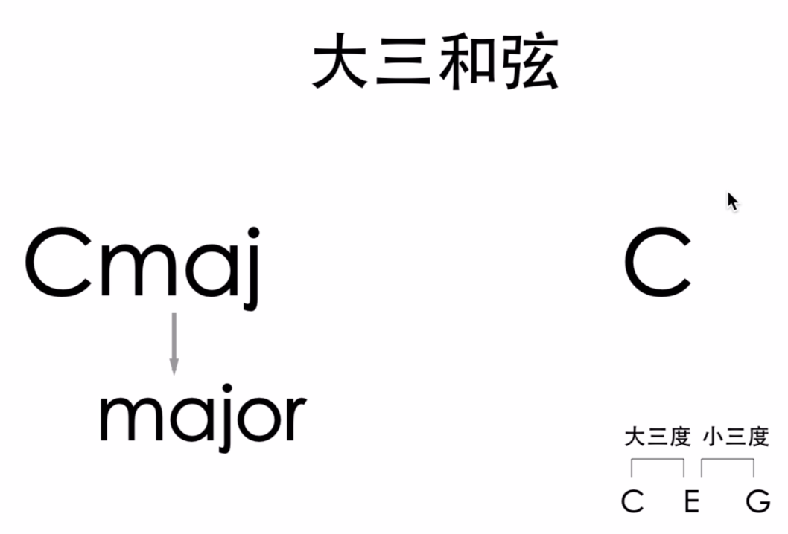
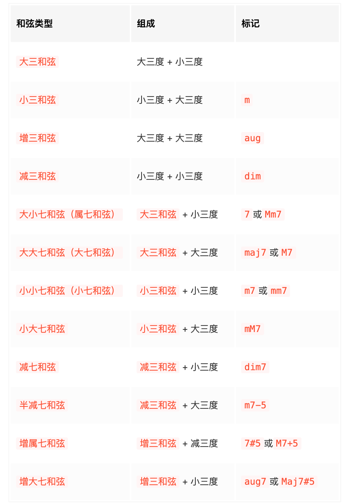

# 2.1 和声

和声（Harmony），指多个不同音高的音同时发声，现代音乐三要素之一。和声是多个音在时间上纵向的发展，主要内容有：

- 音程（interval）：两音之间的距离，单位是以「度」计算。

- 度：描述音程的单位。（“一四五八无大小”）

- 和弦（chord）：多个不同音高的音按照三度或其他度数叠置起来的组合。之后讨论的和弦，默认为三度叠置的和弦。例如 C E G 三个音就构成了一个和弦。和弦的组成音，可同时演奏（称为柱式和弦），也可分开演奏（称为分解和弦）。

- 和弦的种类：按照组成音的数量来区分，和弦可以分为三和弦（triads）、七和弦（sevenths）、九和弦（ninths）等。三和弦是由三个音组成，七和弦是由四个音组成，九和弦则由五个音组成。按照组成音的音程结构再细分，三和弦可以分为大和弦（major chord）、小和弦（minor chord）、增和弦（augmented chord）、减和弦（diminished chord）等。

- 和弦转位：由同样音组成的和弦，在最低音不同时也会有不同的音响效果及使用方式，叫做和弦转位。

- 根音（root）：和弦的组成音中的最低音。三和弦/七和弦中其他根音上方的音分别叫做「三音」、「五音」、「七音」。

- 和弦记号：主要以「根音名 + 和弦的音程种类名（默认为大和弦） + 和弦的组成音数量（默认为三和弦）」来标记和弦。例如 C E G 组成了一个三和弦，且 C - E 是大三度、E - G 是小三度，所以这个三和弦是「大三和弦」，标记为 C （即意为 Cmaj3，省略 maj 与 3。maj 是 major 的简写，有的地方也简写为大写字母 M）。

