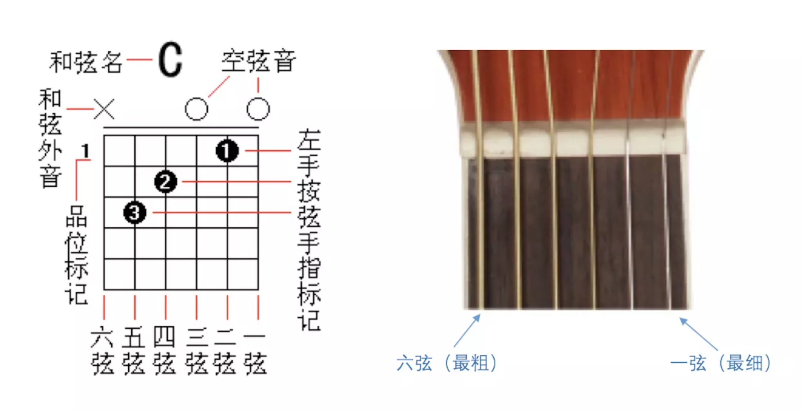
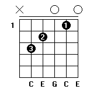
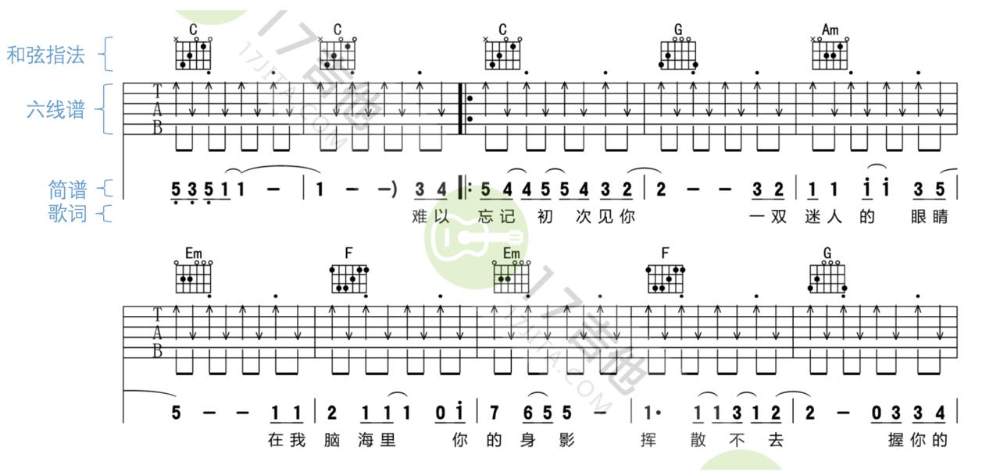

# 2.2 和弦在吉他、吉他谱上的应用

## 左手的和弦指法

- 数字 1 代表食指；
- 2 代表中指；
- 3 代表无名指；
- 4 代表小拇指；
- 如果和弦图中有数字 5 或者字母 T 则代表大拇指。

例如 C 和弦的一种常见指法中：

- 食指按 2 弦 1 品；
- 中指按 4 弦 2 品；
- 无名指按 5 弦 3 品；
- 6 弦不需要用到；
- 1 弦、3 弦空弦（即 0 品）。

那么它从 5 弦 ~ 1 弦的各音为：

C E G C E

这样即通过 C E G 三个音组成了 C 和弦。

需要牢记每个和弦的根音在哪根弦上，左手按和弦时，从根音开始，各个手指依次放到其他位置。

## 和弦图

在六线谱的上方，用和弦图来指示左手指法。

## 右手的节奏型

节奏型就是伴奏中各自具有典型特点的节奏类型。吉他中的节奏型包括分解和弦、柱式和弦（在吉他中称为“扫弦”）等。

例如 4/4 拍中常见的分解和弦节奏型为：

即俗称的「T3231323」。另外「T321」在 4/4 拍中也很常见。

注有和弦图时，左手按住和弦指法，右手依次拨动 × 标示的弦。

4/4 拍中常见的扫弦节奏型为：

注有和弦图时，左手按住和弦指法，右手依次按方向进行上下扫弦。

## 和弦间的切换

切换和弦的要求：快、准。需要大量练习后才能掌握。

切换和弦的时机：右手弹奏完毕，再换和弦。新手可以优先保证右手节奏型稳定，再追求左手在恰当时机切换和弦的快速性，但最终两者都要得到保证。

切换技巧：对于新手训练，刚开始时可以在按完上一个和弦后，左手完全放开，重新按到新的和弦上。熟练后，自然而然会缩小手的运动幅度，从而加快速度。

