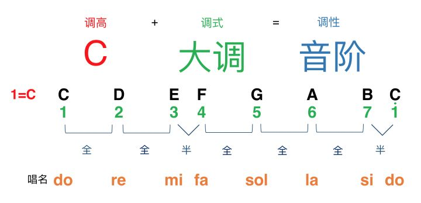
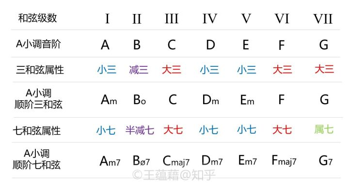

# 2.3 调性

在调性（tonality）音乐中，旋律的走向、和声的进行都是建立在调性体系上的。主要概念有：

- 调式（mode）：几个不同音高的音根据一定的音程关系组成的体系。

- 主音（tonic）：一种调式中最重要的一个音。在听觉上是最稳定最和谐的，其他音通常是围绕着主音出现，并且在结束时通常要回到主音。

- 调高（key）：主音的音高位置，一般直接用主音的音名表示。比如 C 调记作 1=C ，意思是主音为 C 。

- 调性（tonality）：调式与调高的结合。调式确定了这些音之间的关系，调高以主音的音高确定了这些音整体所在的音高。

调式的种类繁多，主要有世界各国遍用的大调式、小调式、各民族调式等。这里主要学习自然大调、自然小调。

- 自然大调式（major/Ionian）：由七个音构成，音程结构是「大二度−大二度−小二度−大二度−大二度−大二度−小二度」，以半音数来计算就是「全全半全全全半」，听起来一般是明朗、开阔的。例如，以 C 作为主音，得到的音阶即为 CDEFGAB，称为「C 自然大调」，简称为「C 大调」，再简称为「C 调」。

- 自然小调式(minor/Aeolian)：由七个音构成，音程结构是「大二度−小二度−大二度−大二度−小二度−大二度−大二度」，以半音数来计算就是「全半全全半全全」，听起来一般是柔和、暗淡的。例如，以 A 作为主音，得到的音阶即为 ABCDEFG，称为「a 自然小调」，简称为「a 小调」。

在大调、小调中依次用每个音做主音，一共可产生 24 种调性/音阶。

- 关系大小调：由同一条音阶形成的大小调互称为关系调/关系大小调。把大调的六级音作为主音重新构建音阶就可以得到这个大调的关系小调，把小调的三级音作为主音重新构建音阶就可以得到小调的关系大调。比如 C 大调（CDEFGAB）和 a 小调（ABCDEFG），或者 G 大调（GABCDEF#）和 e 小调（EF#GABCD）等。

- 转调：在同一首曲子中，由原先的调转成别的调。例如一开始的时候是 C 调，中间转成 G 调。

- 移调：把一首曲子整体平移到另一个调上，也就是常说的「升降 key」。例如原曲是 C 调，移到 G 调。

- 音阶（scale）：将调式中的音，从主音开始，按从高到低（下行音阶）或从低到高（上行音阶）的次序排列起来的队列。

在调性音乐内，调性决定了音阶，音阶又规定了旋律的构成音、规定了和弦的构成音。比如 C 大调（CDEFGAB）下，旋律可以是 CFGGDC，三和弦只能是 C（CEG），Dm（DFA），Em（EGB），F（FAC），G（GBD），Am（ACE），Bdim（BDF）。

- 音级（degree）：以主音为第一级，音阶中每个音都有自己的级数，叫作音级，一般用罗马数字或阿拉伯数字来标识。另外每个音级也有音级名称。

- 和弦级数：调式中的和弦，以根音的音级作为和弦的级数，一般用罗马数字或阿拉伯数字来标识。例如 C 调中，C 和弦（CEG）即为第一级。另外每个和弦级数也有级数名称/功能名称。

- I 级和弦：非常稳定，又称为「主和弦」。

- IV 级和弦：又称为「下属和弦」。

- V 级和弦：称为「属和弦」。

调式中主（I 级）、属（V 级）、下属（IV）和弦的作用十分重要。例如在 C 大调中，主和弦为 C，属和弦为 G，下属和弦为 F 。而在 a 小调中，主和弦为 Am，属和弦为 Em，下属和弦为 Dm 。

大、小调的音程结构决定了：大调的 II 级、III 级、VI 级和弦都是小和弦（minor），小调的 I 级、IV 级、V 级和弦都是小和弦（minor）。
