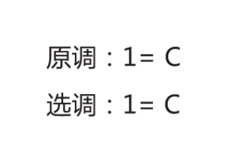

# 2.4 调性在吉他、吉他谱上的应用

## 吉他谱上的调高标注与说明

原调，即曲目原本的调高。1=C ，意思是主音为 C ，即 C 调。

选调，可以理解为「选择用什么调的指法」。1=C ，意思是采用 C 调指法。

## 大调下吉他常用和弦指法

要求首先掌握 C 调、G 调指法，因为比较简单、易学。

## 利用「关系大小调」推导小调下吉他常用和弦指法

关系调的音阶相同，只有音级不同。所以小调也可以用其关系大调的和弦指法，只是和弦级数不同。例如 C 大调、a 小调是关系调，C 大调的 I 级和弦是 C 和弦，a 小调的 I 级和弦是 Am 和弦。

## 利用「变调夹」进行移调

吉他指板上的品格每升一格升高半音，变调夹（Capo）夹在某一品格上，即可升高若干个半音。依据这一点，当曲目的调太高或太低时，可以使用变调夹进行移调，仍然弹奏原调的指法，来达到「移调」的目的。例如 C 调歌曲：

- 不用变调夹的情况下（即 0 品），弹奏 C 调的指法，为 C 调；
- 变调夹夹到 1 品，弹奏 C 调的指法，即升为了 C# 调；
- 变调夹夹到 2 品，弹奏 C 调的指法，即升为了 D 调。

## 利用「变调夹」进行指法简化

依据变调夹的特点，还可以使用「选调 + 变调夹 = 原调」的方法来达到「指法简化（本质也是移调）」的目的。例如：

原调 1=E ，即主音为 E ，即 E 调。

选调 1=C ，即采用 C 调指法。

变调夹夹 4 品，即 Capo=4 。

弹奏 C 调指法，变调夹夹 4 品，即升为了 E 调。

原调 1=E ，即主音为 E ，即 E 调。

选调 1=D ，即采用 D 调指法。

Capo=2，意思是变调夹（Capo）夹 2 品。

弹奏 D 调指法，变调夹夹 2 品，即升为了 E 调。

