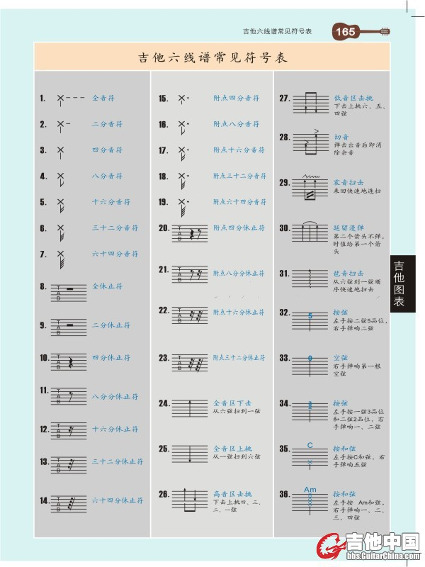
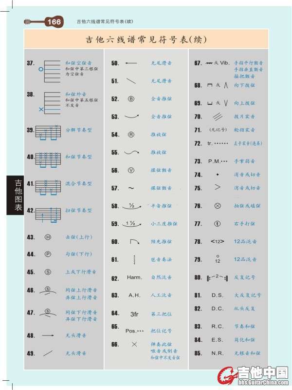

# 3.1 吉他的基本演奏技巧

吉他的演奏技巧如击弦、勾弦、滑弦等，可以让吉他演奏效果变得更加丰富、灵动。

- 击弦（上行）：用字母「H」表示。例如弧线连接的是 5 和 7 的时候，就表示左手食指按住 5 品，右手弹响让后顺势左手无名指击弦 7 品。

- 勾弦（下行）：用字母「P」表示。例如弧线连接两个数字 7 和 5 时，就表示我们左手食指按在 5 品，同时无名指按住 7 品，右手弹响 7 品后，手指顺势勾响 5 品。

- 滑音：用字母「S」表示，弹响某一个音后，左手用同一个手指滑到另外一个音。例如弧线连接的是 5 和 7 的时候，就表示左手食指按住 5 品，右手弹响后左手食指滑到 7 品。按照音的方向可分为上行滑音、下行滑音；按照有无起始音、结束音可以分为无头滑音、无尾滑音，一般用带左右箭头的横线或斜线来表示。

- 泛音：吉他作为弦乐器，在拨响琴弦的时候全弦振动产生的音，就是基音；弦的 1/2、1/3 ……等分部分振动所产生的音就是泛音。弦的各个分段点叫做泛音点，例如 3 品是空弦的 1/6 泛音点，4 品是空弦的 1/5 泛音点，5 品是空弦的 1/4 泛音点，9 品是空弦的 2/5 泛音点，12 品是空弦的 1/2泛音点，16 品是空弦的 3/5 泛音点，19 品是空弦的 2/3 泛音点。演奏方法：右手食指轻触泛音点，然后用右手的无名指或者拇指拨弦，同时右手食指离开。空弦上演奏泛音叫做「自然泛音」(Harm.)，通过左手按弦的方式，来改变弦振动的弧长，以弹奏每一个品格处的泛音，叫做「人工泛音」(A.H.)。

- 琶音：是一种特殊的分解和弦，用带有箭头的曲线表示。按照箭头顺序依次拨出。
