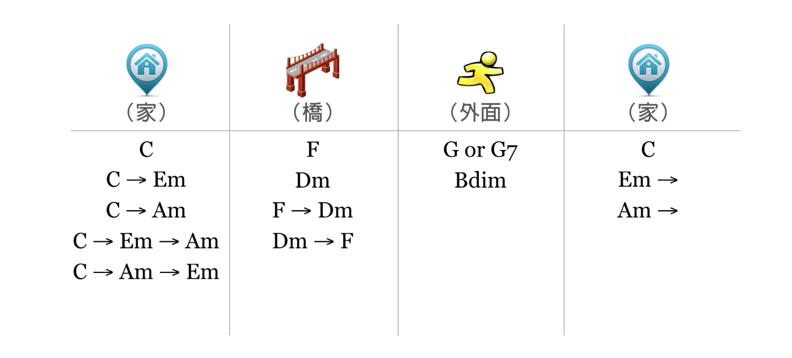

# 4.2 编配和声进行

编配要求：

1. 和弦与旋律音要协和。和弦与旋律音搭配后，旋律音可能是和弦内音或和弦外音。和弦内音一定是协和的，和弦外音可以简单地在听觉上判断是否是协和的。
2. 和声进行的良好性。即每一级和弦的功能以及其前后连接是否正确，总的特点是 `稳定 — 不稳定 — 稳定`，具体表现为 `主 — 下属 — 属 — 主` 的功能序列。详细说明如下：

主功能组和弦: `VI, I, III`，代表着开始、结束、完成了，有一种「家」的感觉；

下属功能组和弦: `II, IV, VI`，代表着跨出一步，有一种「桥」的感觉；

属功能组和弦: `III, V, VII`，代表着不稳定、未完成，有一种「外面」的感觉。

这样，和声进行就应该是由主功能组和弦开始，接下属功能组，再接属功能组，再接主功能组。

例如 C 调下，各个和弦归类与连接可以如下图，排列组合可以获得一百多条不同的和声进行：

